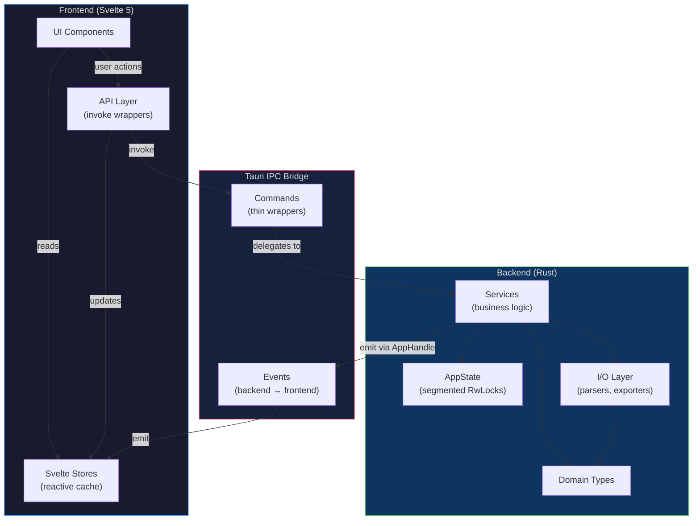
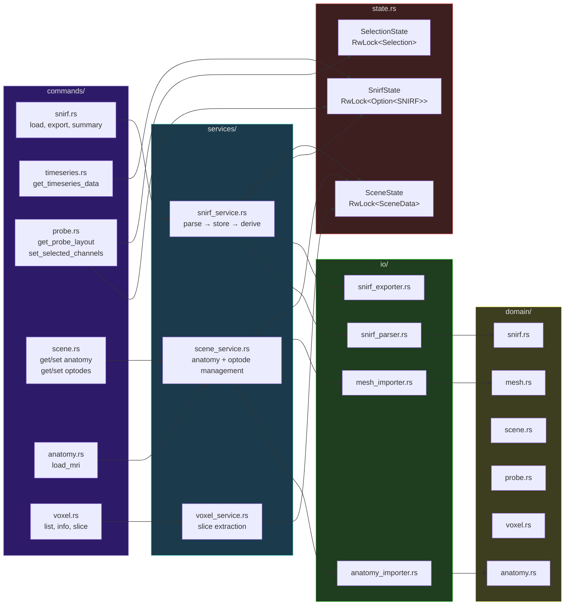
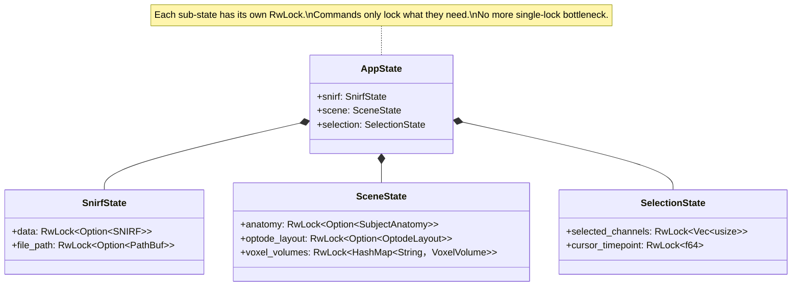
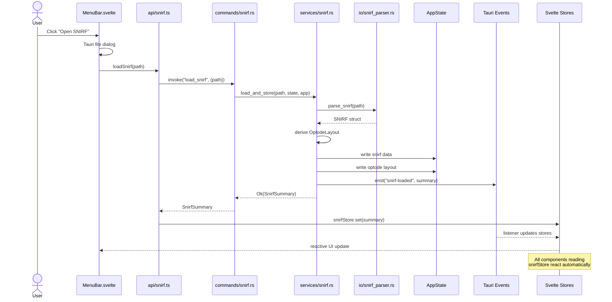
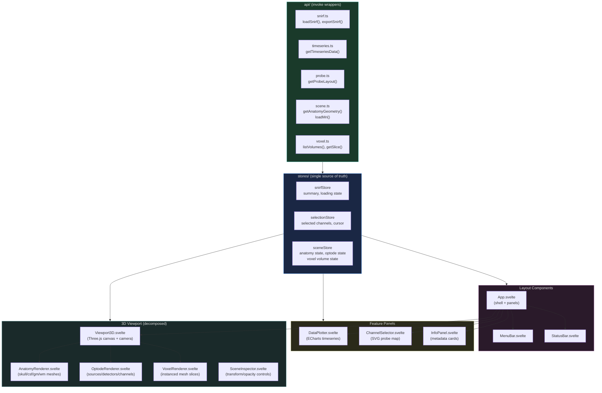
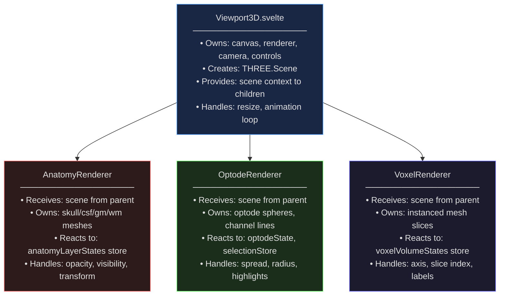
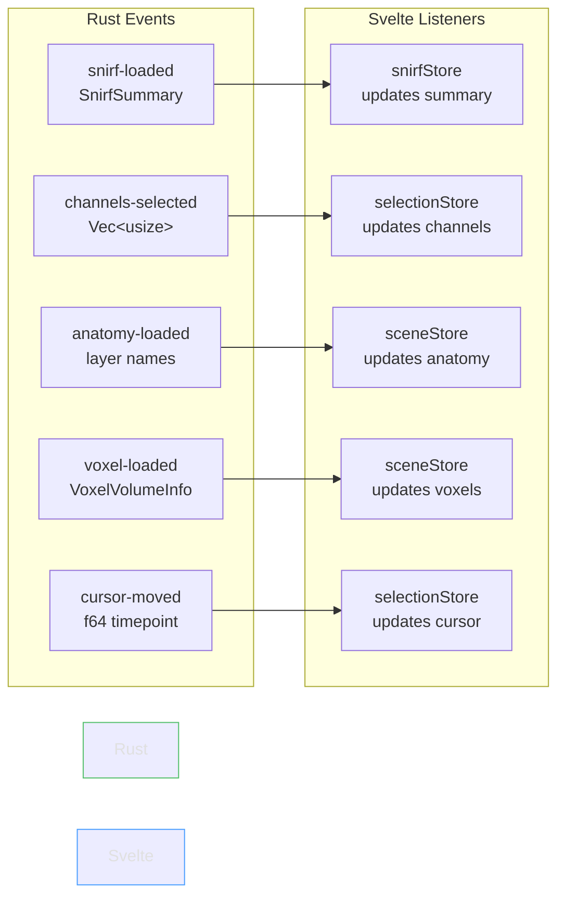

# NIRWizard v2 — Architecture Review & Rewrite Plan

## Current State Assessment

### What You Have (and what's solid)

Your existing codebase has good bones. The domain model is clean — `SNIRF`, `Channel`, `Optode`, `Probe` are well-defined. The SNIRF HDF5 parser is thorough. The separation between `domain/`, `io/`, and `commands/` is the right instinct. The `AppState → RwLock<Session>` pattern is correct for Tauri.

### What Needs Work

**1. The "God Session" problem.** Your `Session` struct holds everything — SNIRF data, anatomy, voxel volumes, optode layout, pipeline, selected channels. This becomes unmanageable as features grow. Every command locks the entire session even if it only needs one field.

**2. Commands are doing too much.** `load_snirf` parses, stores, derives optode layout, and emits events — all in one function. Commands should be thin wrappers.

**3. Frontend state is ad-hoc.** Some state lives in Svelte `let` variables in `App.svelte`, some in stores (`sceneState.js`, `pipeline.js`), and some is fetched on-demand. There's no consistent pattern for when to cache vs. re-fetch.

**4. The preprocessing pipeline is half-built.** `processing/mod.rs` is empty, `Pipeline` and `StepKind` exist in domain but have no execution path. Since you're dropping preprocessing, this entire subtree goes away — which is the right call.

**5. Tight coupling in the 3D view.** `Viewport3D.svelte` (467 lines) manages Three.js scene graph, anatomy layers, voxels, optodes, and channel selection all in one component. This is your ImGui instincts showing — everything in one render loop. It needs decomposition.

---

## Rewrite Scope: What You're Keeping vs. Dropping

### Keep
- SNIRF parsing (`io/snirf_parser.rs`) — this is working and complex
- SNIRF export (`io/snirf_exporter.rs`)
- Core domain types: `SNIRF`, `Channel`, `Optode`, `Probe`, `Events`
- Anatomy import + mesh loading (`io/anatomy_importer.rs`, `io/mesh_importer.rs`)
- 3D scene concepts: `Transform`, `SceneObject`, `Mesh`
- Voxel volume handling

### Drop
- `processing/` module entirely
- `Pipeline`, `StepKind`, `BandpassParams`, `PruningParams`
- All pipeline-related commands and frontend components
- `PipelineEditor.svelte`, `PipelineOrder.svelte`, `ParameterEditor.svelte`, `AvailableSteps.svelte`
- `stepDefinitions.js`, `stores/pipeline.js`

### Redesign
- State architecture (Rust side)
- Command layer (thinner, service-oriented)
- Frontend state management (unified store pattern)
- 3D viewport (decomposed components)
- Layout system

---

## New Architecture

### High-Level System Flow



---

### Rust Backend Architecture



---

### Segmented State (replacing the God Session)



#### Why this matters:

With a single `RwLock<Session>`, a command reading channel data blocks a command writing selected channels. With segmented locks, `get_timeseries_data` locks `SnirfState` while `set_selected_channels` locks `SelectionState` — no contention.

```rust
// NEW: segmented state
pub struct AppState {
    pub snirf: SnirfState,
    pub scene: SceneState,
    pub selection: SelectionState,
}

pub struct SnirfState {
    pub data: RwLock<Option<SNIRF>>,
    pub file_path: RwLock<Option<PathBuf>>,
}

pub struct SceneState {
    pub anatomy: RwLock<Option<SubjectAnatomy>>,
    pub optode_layout: RwLock<Option<OptodeLayout>>,
    pub voxel_volumes: RwLock<HashMap<String, VoxelVolume>>,
}

pub struct SelectionState {
    pub selected_channels: RwLock<Vec<usize>>,
    pub cursor_timepoint: RwLock<f64>,
}
```

---

### Services Layer (New)

The key architectural change. Commands become thin, services hold logic:

```rust
// commands/snirf.rs — THIN
#[tauri::command]
pub fn load_snirf(
    path: String,
    state: State<'_, AppState>,
    app: AppHandle,
) -> Result<SnirfSummary, String> {
    services::snirf::load_and_store(&path, &state, &app)
}

// services/snirf.rs — LOGIC LIVES HERE
pub fn load_and_store(
    path: &str,
    state: &AppState,
    app: &AppHandle,
) -> Result<SnirfSummary, String> {
    let snirf = io::snirf_parser::parse_snirf(path)?;
    let summary = SnirfSummary::from(&snirf);
    let optode_layout = OptodeLayout::from_snirf(&snirf);

    // Lock only what we need, separately
    {
        let mut data = state.snirf.data.write().map_err(|e| e.to_string())?;
        *data = Some(snirf);
    }
    {
        let mut layout = state.scene.optode_layout.write().map_err(|e| e.to_string())?;
        *layout = Some(optode_layout);
    }

    app.emit("snirf-loaded", &summary).map_err(|e| e.to_string())?;
    Ok(summary)
}
```

This separation means:
- Services are testable without Tauri (pass `&AppState` directly)
- Commands are trivially auditable (just delegation)
- Logic can be shared between commands without pub-use gymnastics

---

### Data Flow: Loading a SNIRF File



---

### Frontend Architecture



---

### The API Layer Pattern

Instead of calling `invoke` directly from components (which scatters IPC knowledge everywhere), wrap every command in a typed function:

```typescript
// src/lib/api/snirf.ts
import { invoke } from '@tauri-apps/api/core';
import { snirfStore } from '../stores/snirf';

export interface SnirfSummary {
  filename: string;
  channels: number;
  sources: number;
  detectors: number;
  timepoints: number;
  sampling_rate: number;
  duration: number;
  hbo_wavelength: number;
  hbr_wavelength: number;
  events: { name: string; count: number }[];
  aux_count: number;
}

export async function loadSnirf(path: string): Promise<SnirfSummary> {
  const summary = await invoke<SnirfSummary>('load_snirf', { path });
  snirfStore.set(summary);
  return summary;
}

export async function exportSnirf(path: string): Promise<void> {
  await invoke('export_snirf', { path });
}

export async function getSnirfSummary(): Promise<SnirfSummary | null> {
  return invoke<SnirfSummary | null>('get_snirf_summary');
}
```

Components never import `invoke` directly. They import from `api/`:

```svelte
<script>
  // BEFORE (scattered invoke calls)
  import { invoke } from '@tauri-apps/api/core';
  const data = await invoke('get_timeseries_data', { channelIds });
  
  // AFTER (typed, centralized)
  import { getTimeseriesData } from '$lib/api/timeseries';
  const data = await getTimeseriesData(channelIds);
</script>
```

---

### 3D Viewport Decomposition

Your current `Viewport3D.svelte` (467 lines) does too much. Break it apart:



Use Svelte's context API to share the Three.js scene:

```svelte
<!-- Viewport3D.svelte -->
<script>
  import { setContext } from 'svelte';
  const scene = new THREE.Scene();
  setContext('three-scene', scene);
</script>

<canvas bind:this={canvas}></canvas>
<AnatomyRenderer />
<OptodeRenderer />
<VoxelRenderer />
```

```svelte
<!-- AnatomyRenderer.svelte -->
<script>
  import { getContext } from 'svelte';
  const scene = getContext('three-scene');
  // Only manages anatomy meshes — nothing else
</script>
```

---

### New Project Structure

```
NIRWizard/
├── src/                              # Svelte frontend
│   ├── App.svelte                    # Shell layout only
│   ├── main.ts                       # Mount point (switch to TS)
│   ├── app.css                       # Global theme vars
│   └── lib/
│       ├── api/                      # ← NEW: typed invoke wrappers
│       │   ├── snirf.ts
│       │   ├── timeseries.ts
│       │   ├── probe.ts
│       │   ├── scene.ts
│       │   └── voxel.ts
│       ├── stores/                   # Unified reactive state
│       │   ├── snirf.ts
│       │   ├── selection.ts
│       │   └── scene.ts
│       ├── components/               # UI components
│       │   ├── layout/
│       │   │   ├── MenuBar.svelte
│       │   │   ├── StatusBar.svelte
│       │   │   └── PanelLayout.svelte
│       │   ├── data/
│       │   │   ├── DataPlotter.svelte
│       │   │   ├── ChannelSelector.svelte
│       │   │   └── InfoPanel.svelte
│       │   └── scene/
│       │       ├── Viewport3D.svelte
│       │       ├── AnatomyRenderer.svelte
│       │       ├── OptodeRenderer.svelte
│       │       ├── VoxelRenderer.svelte
│       │       └── SceneInspector.svelte
│       └── utils/
│           └── colormap.ts
│
├── src-tauri/
│   └── src/
│       ├── main.rs                   # Entry point (thin)
│       ├── state.rs                  # Segmented AppState
│       ├── commands/                 # Thin command layer
│       │   ├── mod.rs
│       │   ├── snirf.rs
│       │   ├── timeseries.rs
│       │   ├── probe.rs
│       │   ├── scene.rs
│       │   ├── anatomy.rs
│       │   └── voxel.rs
│       ├── services/                 # ← NEW: business logic
│       │   ├── mod.rs
│       │   ├── snirf_service.rs
│       │   ├── scene_service.rs
│       │   └── voxel_service.rs
│       ├── domain/                   # Pure data types
│       │   ├── mod.rs
│       │   ├── snirf.rs
│       │   ├── mesh.rs
│       │   ├── scene.rs
│       │   ├── probe.rs
│       │   ├── anatomy.rs
│       │   └── voxel.rs
│       └── io/                       # File I/O
│           ├── mod.rs
│           ├── snirf_parser.rs
│           ├── snirf_exporter.rs
│           ├── anatomy_importer.rs
│           └── mesh_importer.rs
```

---

### Event System (backend → frontend)



Set up listeners once at app startup, writing to stores. Components subscribe to stores — they never listen to raw events.

```typescript
// src/lib/api/events.ts — initialized once in App.svelte onMount
import { listen } from '@tauri-apps/api/event';
import { snirfStore } from '../stores/snirf';
import { selectionStore } from '../stores/selection';
import { sceneStore } from '../stores/scene';

export async function initEventListeners(): Promise<() => void> {
  const unlisteners = await Promise.all([
    listen('snirf-loaded', (e) => snirfStore.set(e.payload)),
    listen('channels-selected', (e) => selectionStore.setChannels(e.payload)),
    listen('anatomy-loaded', (e) => sceneStore.setAnatomy(e.payload)),
    listen('voxel-loaded', (e) => sceneStore.addVoxelVolume(e.payload)),
  ]);
  
  return () => unlisteners.forEach(fn => fn());
}
```

---

## Migration Strategy

### Phase 1: Foundation (do first)
1. Switch frontend to TypeScript
2. Create `api/` layer — wrap all existing `invoke` calls
3. Create unified stores
4. Restructure Rust: add `services/`, move logic out of commands
5. Implement segmented `AppState`

### Phase 2: Cleanup
1. Delete all `processing/` and `pipeline/` code (both sides)
2. Delete pipeline Svelte components and stores
3. Remove `StepKind`, `PipelineStep`, `Pipeline` from domain

### Phase 3: Decompose
1. Break `Viewport3D.svelte` into sub-renderers
2. Break `DataPlotter.svelte` into smaller chart-focused components
3. Extract panel layout logic from `App.svelte` into `PanelLayout.svelte`

### Phase 4: Polish
1. Proper error handling (Rust error types, not `.to_string()` everywhere)
2. Loading states in stores
3. TypeScript interfaces matching Rust serde output
