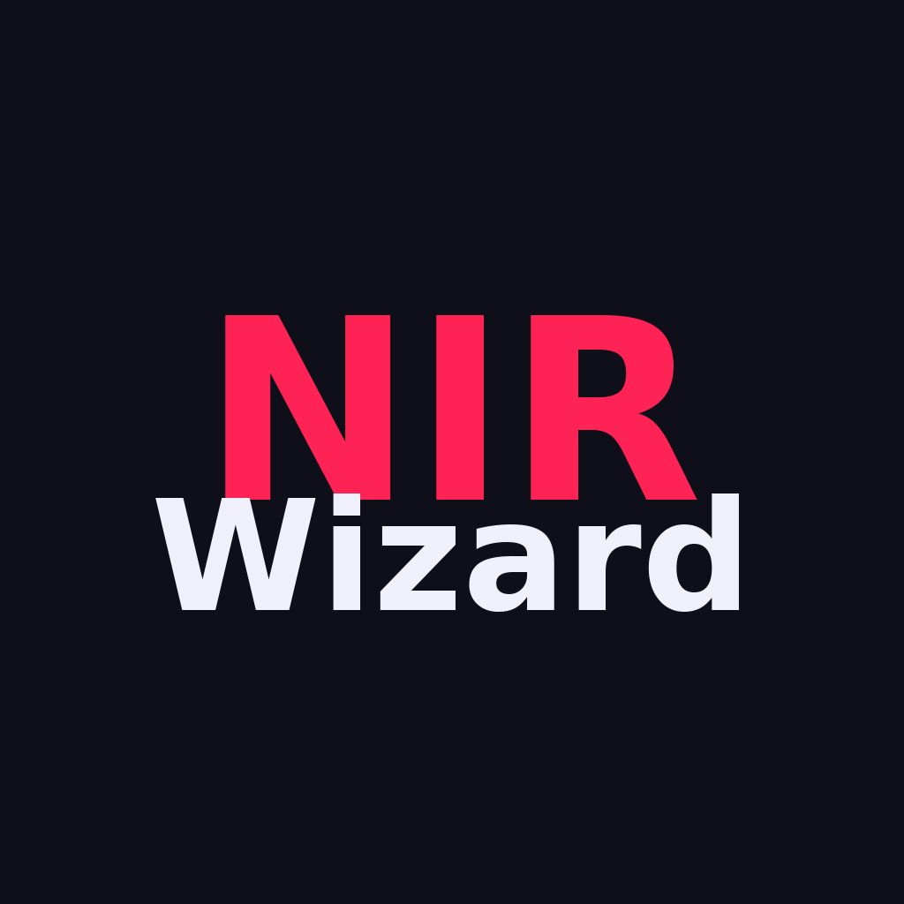

# NIRWizard

<p align="center">
  
</p>

A desktop application for loading and analyzing fNIRS (functional Near-Infrared Spectroscopy) data in the SNIRF file format.

Built with **Tauri 2**, **Svelte 5**, and **Rust**.

---

## What is fNIRS?

Functional Near-Infrared Spectroscopy (fNIRS) is a non-invasive neuroimaging technique that measures brain activity by shining near-infrared light into the scalp and detecting how much is absorbed. Oxygenated hemoglobin (HbO) and deoxygenated hemoglobin (HbR) absorb light differently at distinct wavelengths (typically ~690 nm for HbR and ~830 nm for HbO), allowing their concentrations to be tracked over time.

A typical fNIRS setup consists of **sources** (light emitters) and **detectors** placed on the scalp. Each source-detector pair forms a **channel** that samples the cortical region between them.

---

## The SNIRF Format

SNIRF (Shared Near Infrared Spectroscopy Format) is the community-standard file format for fNIRS data. SNIRF files are HDF5 containers with a defined internal structure:

```
/nirs/
  metaDataTags/          # Key-value metadata (subject ID, date, etc.)
  probe/
    wavelengths          # e.g. [690, 830]
    sourcePos2D / sourcePos3D
    detectorPos2D / detectorPos3D
  data1/
    dataTimeSeries       # [timepoints x channels] raw optical density matrix
    time                 # time vector (seconds)
    measurementList1/    # one group per column in dataTimeSeries
      sourceIndex
      detectorIndex
      wavelengthIndex
    measurementList2/
    ...
  stim1/                 # event/stimulus blocks (optional)
    name
    data                 # [markers x 3] -- onset, duration, value
  aux1/                  # auxiliary signals, e.g. accelerometer (optional)
    ...
```

---

## Parsing

NIRWizard parses SNIRF files in Rust using the `hdf5-metno` crate. The parsed data is mapped to the following domain model:

```
SNIRF
+-- FileDescriptor       -- file path and name
+-- Metadata             -- metaDataTags key-value pairs
+-- Wavelengths          -- HbO and HbR wavelengths (nm)
+-- Probe
|   +-- sources[]        -- source optodes with 2D/3D positions
|   +-- detectors[]      -- detector optodes with 2D/3D positions
+-- ChannelData
|   +-- time[]           -- shared time vector
|   +-- channels[]
|       +-- name         -- e.g. "S1-D2"
|       +-- source_id / detector_id
|       +-- hbo[]        -- HbO time series for this channel
|       +-- hbr[]        -- HbR time series for this channel
+-- Events
|   +-- events[]
|       +-- name         -- stimulus condition label
|       +-- markers[]    -- onset, duration, value per marker
+-- BiosignalData        -- auxiliary signals (accelerometer, etc.)
```

The `dataTimeSeries` matrix contains interleaved columns for each wavelength. NIRWizard reads the `measurementList` entries to identify which columns correspond to HbO vs HbR for each source-detector pair, then splits and assigns them into typed `Channel` structs.

---

## Tech Stack

| Layer     | Technology                  |
|-----------|-----------------------------|
| Frontend  | Svelte 5, Vite 7            |
| Desktop   | Tauri 2                     |
| Backend   | Rust (edition 2021)         |
| Data I/O  | HDF5 via `hdf5-metno` crate |
| Numerics  | `ndarray` 0.15              |

---

## Running

```bash
# Development
npx tauri dev

# Production build
npx tauri build
```

Set `NIRWIZARD_DEFAULT_SNIRF=/path/to/file.snirf` to auto-load a file on startup during development.
